# Solana - Learn How to Build a Client-Side App: Part 2

## 1

### --description--

In this project, you will learn how to use the Phantom wallet browser extension to connect to your local validator, connect your wallet to a dApp, and sign transactions.

Change into the `learn-how-to-build-a-client-side-app-part-2/` directory in a new terminal.

### --tests--

You should be in the `learn-how-to-build-a-client-side-app-part-2/` directory.

```js
const cwd = await __helpers.getLastCWD();
const dirRegex = new RegExp(`${project.dashedName}/?$`);
assert.match(cwd, dirRegex);
```

## 2

### --description--

You have been started out with the same Tic-Tac-Toe Anchor program as the last project.

Previously, you manually copy-pasted the player keypairs into the client app. This is both insecure and a poor user experience.

Instead, install the `@solana/wallet-adapter-phantom` package in `app/` to handle connecting to the Phantom Wallet - a multi-chain wallet.

### --tests--

You should have `@solana/wallet-adapter-phantom` in `app/package.json`.

```js

```

## 3

### --description--

Within `web3.js`, replace the `Wallet` import with `PhantomWalletAdapter` from `@solana/wallet-adapter-phantom`.

### --tests--

You should not import `Wallet` from `./wallet.js`.

```js

```

You should import `PhantomWalletAdapter` from `@solana/wallet-adapter-phantom`.

```js

```

## 4

### --description--

Within the `connectWallet` function, delete all the keypair logic, and assign `wallet` a new instance of `PhantomWalletAdapter`.

### --tests--

You should remove the `keypairArr` declaration from `connectWallet`.

```js

```

You should remove the `uint` declaration from `connectWallet`.

```js

```

You should remove the `keypair` declaration from `connectWallet`.

```js

```

You should have `const wallet = new PhantomWalletAdapter()` within `connectWallet`.

```js

```

## 5

### --description--

Similarly, remove all the keypair logic within the `startGame` function.

### --tests--

You should remove the `keypairStr` declaration from `startGame`.

```js

```

You should remove the `keypairArr` declaration from `startGame`.

```js

```

You should remove the `uint8Array` declaration from `startGame`.

```js

```

You should remove the `keypair` declaration from `startGame`.

```js

```

## 6

### --description--

The Phantom Browser Extension injects a global `window.phantom` object into the browser. This object contains the chains and public keys of the currently connected wallet.

Within `startGame`, set the `playerOne` account public key to `window.phantom.solana.publicKey`.

### --tests--

You should have `.accounts({playerOne:window.phantom.solana.publicKey})` within `startGame`.

```js

```

## 7

### --description--

Within `startGame`, seeing as the wallet is handling the signing, remove the `keypair` as a `signer` to the rpc call.

### --tests--

You should remove `.signers([keypair])` from `startGame`.

```js

```

## 8

### --description--

Within `startGame`, remove the keypair logic from the `handlePlay` function.

### --tests--

You should remove the `keypairStr` declaration from `handlePlay`.

```js

```

You should remove the `keypairArr` declaration from `handlePlay`.

```js

```

You should remove the `uint8Array` declaration from `handlePlay`.

```js

```

You should remove the `keypair` declaration from `handlePlay`.

```js

```

## 9

### --description--

Within `handlePlay`, remove the `keypair` as a `signer` to the rpc call.

### --tests--

You should remove `.signers([keypair])` from `handlePlay`.

```js

```

## 10

### --description--

Within `handlePlay`, set the `player` account public key to the public key of the wallet.

### --tests--

You should have `.accounts({player:window.phantom.solana.publicKey})` within `handlePlay`.

```js

```

## 11

### --description--

The proceeding lessons do not have any tests. Follow the instructions, and once you are confident you have completed the task, type `done` in the terminal.

Type `done` in the terminal to move on to the next lesson.

### --tests--

You should type `done` in the terminal.

```js
const lastCommand = await __helpers.getLastCommand();
assert.include(lastCommand, 'done');
```

## 12

### --description--

Within a browser, navigate to https://phantom.app/ to install the Phantom browser extension.

### --tests--

You should type `done` in the terminal.

```js
const lastCommand = await __helpers.getLastCommand();
assert.include(lastCommand, 'done');
```

## 13

### --description--

Click the "Download" button, and follow your browser's instructions to add the extension.

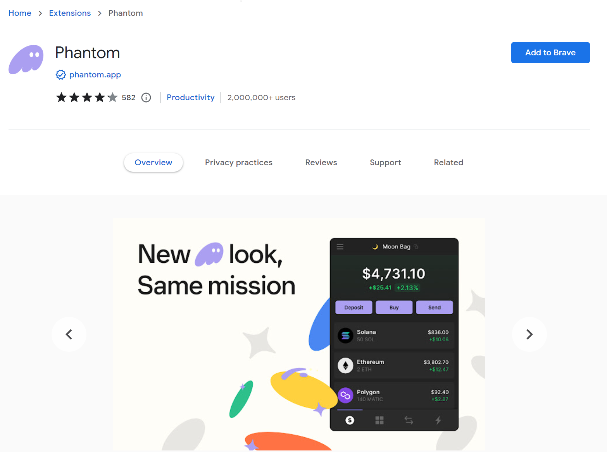

### --tests--

You should type `done` in the terminal.

```js
const lastCommand = await __helpers.getLastCommand();
assert.include(lastCommand, 'done');
```

## 14

### --description--

After installing the extension, click the Phantom icon in your browser's toolbar to set up your wallet.

Create a password, and click "Continue".

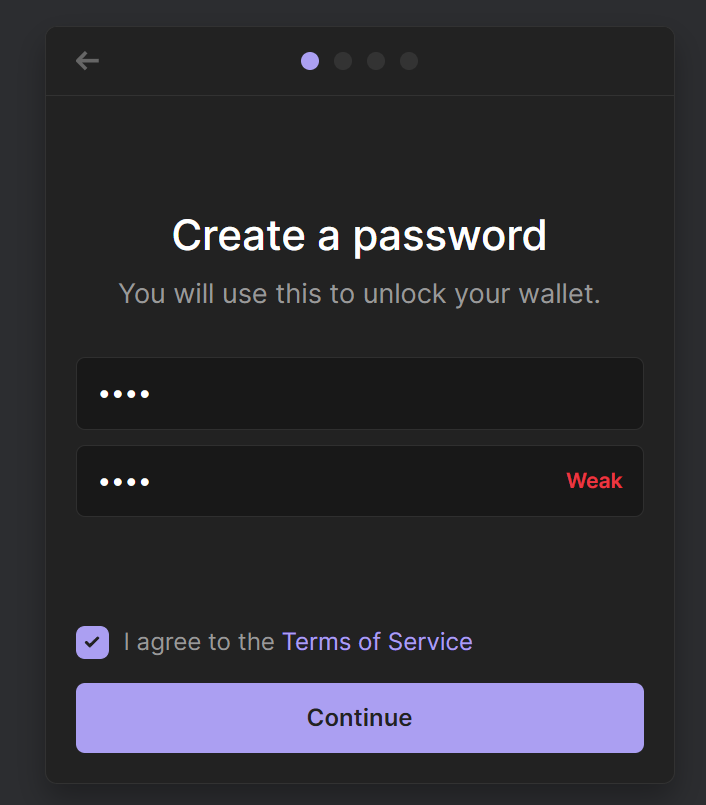

### --tests--

You should type `done` in the terminal.

```js
const lastCommand = await __helpers.getLastCommand();
assert.include(lastCommand, 'done');
```

## 15

### --description--

Take note of your secret recovery phrase. This is the only way to recover your wallet if you forget your password, and can be used to import your wallet into other browsers/platforms. Then, click "Continue".

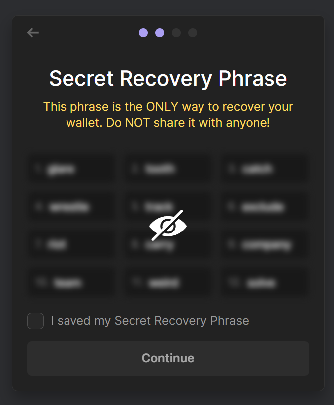

### --tests--

You should type `done` in the terminal.

```js
const lastCommand = await __helpers.getLastCommand();
assert.include(lastCommand, 'done');
```

## 16

### --description--

Finish reading the setup information, and click the Phantom icon in your browser's toolbar to open the extension.

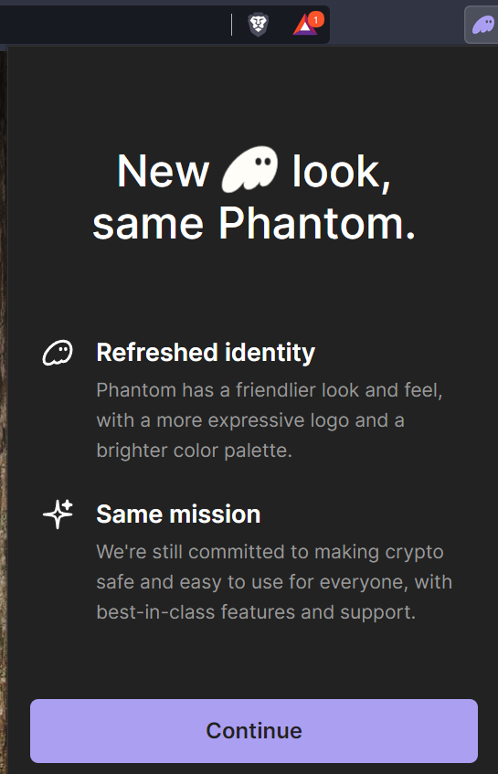

### --tests--

You should type `done` in the terminal.

```js
const lastCommand = await __helpers.getLastCommand();
assert.include(lastCommand, 'done');
```

## 17

### --description--

You should a UI similar to:

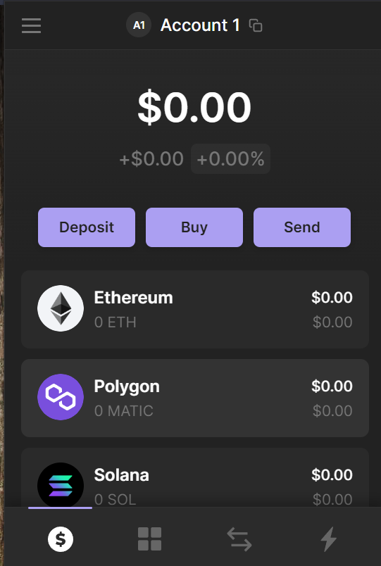

Open the menubar by clicking the three dots in the top left corner.

### --tests--

You should type `done` in the terminal.

```js
const lastCommand = await __helpers.getLastCommand();
assert.include(lastCommand, 'done');
```

## 18

### --description--

Open the settings page:

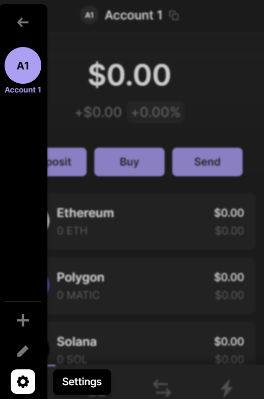

### --tests--

You should type `done` in the terminal.

```js
const lastCommand = await __helpers.getLastCommand();
assert.include(lastCommand, 'done');
```

## 19

### --description--

Click the "Developer Settings" button.

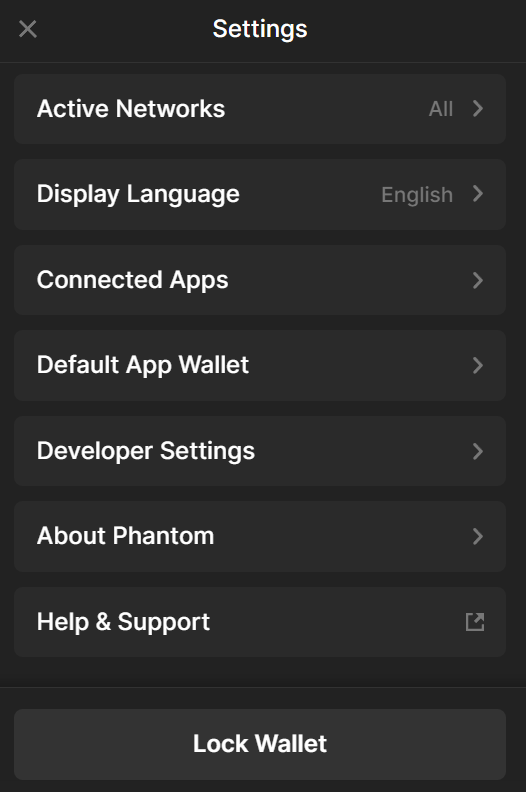

### --tests--

You should type `done` in the terminal.

```js
const lastCommand = await __helpers.getLastCommand();
assert.include(lastCommand, 'done');
```

## 20

### --description--

Enable the "Testnet Mode" in order to connect to your local validator.


### --tests--

You should type `done` in the terminal.

```js
const lastCommand = await __helpers.getLastCommand();
assert.include(lastCommand, 'done');
```

## 21

### --description--

Click the Solana network button.


### --tests--

You should type `done` in the terminal.

```js
const lastCommand = await __helpers.getLastCommand();
assert.include(lastCommand, 'done');
```

## 22

### --description--

Select the "Solana Localnet" option.

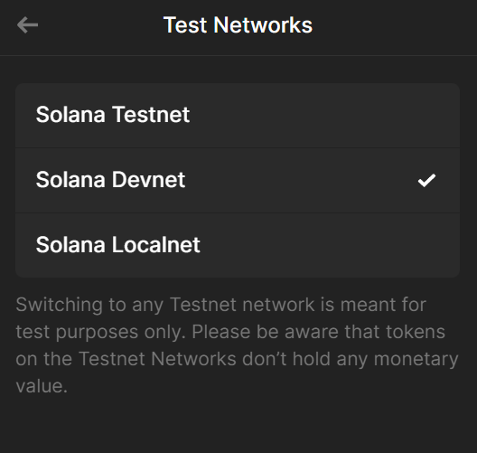

### --tests--

You should type `done` in the terminal.

```js
const lastCommand = await __helpers.getLastCommand();
assert.include(lastCommand, 'done');
```

## 23

### --description--

From the menubar, click the account to edit it.


### --tests--

You should type `done` in the terminal.

```js
const lastCommand = await __helpers.getLastCommand();
assert.include(lastCommand, 'done');
```

## 24

### --description--

Change the account name to `Player 1` to help you keep track of it.


### --tests--

You should type `done` in the terminal.

```js
const lastCommand = await __helpers.getLastCommand();
assert.include(lastCommand, 'done');
```

## 25

### --description--

Within your terminal, start a local validator, being sure to deploy the `tic_tac_toe.so` program at the same time.

### --tests--

The validator should be running at `http://localhost:8899`.

```js
const command = `curl http://localhost:8899 -X POST -H "Content-Type: application/json" -d '{"jsonrpc":"2.0","id":1, "method":"getHealth"}'`;
const { stdout, stderr } = await __helpers.getCommandOutput(command);
try {
  const jsonOut = JSON.parse(stdout);
  assert.deepInclude(jsonOut, { result: 'ok' });
} catch (e) {
  assert.fail(e, 'Try running `solana-test-validator` in a separate terminal');
}
```

The mess program should be deployed.

```js
const command = `curl http://127.0.0.1:8899 -X POST -H "Content-Type: application/json" -d '
  {
    "jsonrpc": "2.0",
    "id": 1,
    "method": "getProgramAccounts",
    "params": [
      "BPFLoader2111111111111111111111111111111111", {
        "encoding": "base64",
        "dataSlice": {
          "length": 0,
          "offset": 0
        }
      }
    ]
}'`;
const { stdout, stderr } = await __helpers.getCommandOutput(command);
const programId = '5xGwZASoE5ZgxKgaisJNaGTGzMKzjyyBGv9FCUtu2m1c';
try {
  const jsonOut = JSON.parse(stdout);
  assert.exists(jsonOut.result.find(r => r.pubkey === programId));
} catch (e) {
  assert.fail(
    e,
    `Try running \`solana-test-validator --bpf-program ${programId} tic_tac_toe.so --reset\``
  );
}
```

Within the Phantom browser extension, click on your account name to get your Solana public key:

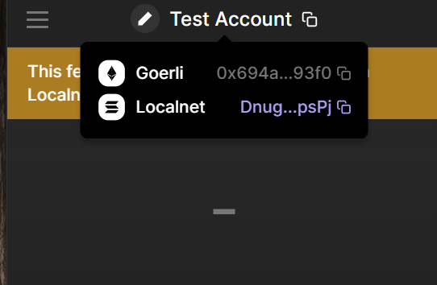

### --tests--

You should type `done` in the terminal.

```js
const lastCommand = await __helpers.getLastCommand();
assert.include(lastCommand, 'done');
```

## 26

### --description--

Within your terminal, airdrop to your account.

### --tests--

You should type `done` in the terminal.

```js
const lastCommand = await __helpers.getLastCommand();
assert.include(lastCommand, 'done');
```

## 27

### --description--

Within the `app/` directory, start the client app server with `yarn dev`.

### --tests--

You should type `done` in the terminal.

```js
const lastCommand = await __helpers.getLastCommand();
assert.include(lastCommand, 'done');
```

## 28

### --description--

Within your browser, navigate to http://localhost:5173/. You should see the client app.

Connect your wallet to the app by clicking the "Connect Wallet" button.

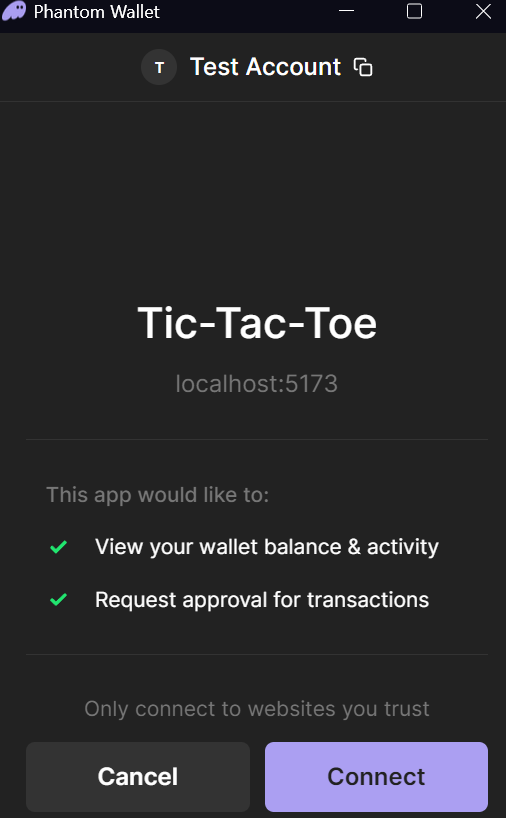

### --tests--

You should type `done` in the terminal.

```js
const lastCommand = await __helpers.getLastCommand();
assert.include(lastCommand, 'done');
```

## 29

### --description--

Within the Phantom browser extension, create a second Solana account:


### --tests--

You should type `done` in the terminal.

```js
const lastCommand = await __helpers.getLastCommand();
assert.include(lastCommand, 'done');
```

## 30

### --description--

Rename the second account to `Player 2`:


### --tests--

You should type `done` in the terminal.

```js
const lastCommand = await __helpers.getLastCommand();
assert.include(lastCommand, 'done');
```

## 31

### --description--

Within your terminal, airdrop to the second account.

### --tests--

You should type `done` in the terminal.

```js
const lastCommand = await __helpers.getLastCommand();
assert.include(lastCommand, 'done');
```

## 32

### --description--

Within the Phantom browser extension, ensure you are on your `Player 1` account.

Within the client app, add the two public keys and any game id.

### --tests--

You should type `done` in the terminal.

```js
const lastCommand = await __helpers.getLastCommand();
assert.include(lastCommand, 'done');
```

## 33

### --description--

Within the client app, click the start game button.

The Phantom browser extension should prompt you to approve the transaction. Approve it.

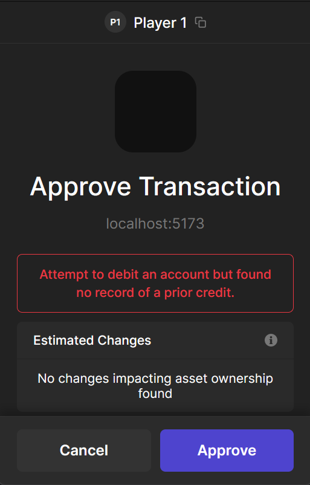

### --tests--

You should type `done` in the terminal.

```js
const lastCommand = await __helpers.getLastCommand();
assert.include(lastCommand, 'done');
```

## 34

### --description--

Once the game is started, you can play the game by opening a second browser window, and connecting to the second account.


### --tests--

You should type `done` in the terminal.

```js
const lastCommand = await __helpers.getLastCommand();
assert.include(lastCommand, 'done');
```

## 35

### --description--

Congratulations on finishing this project! Feel free to play with your code.

**Summary**:

1. Navigate to https://phantom.app/
2. Install the Phantom browser extension
   
   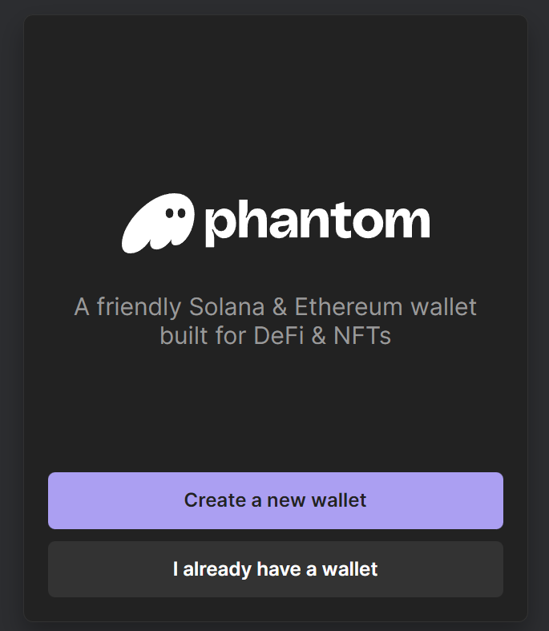
   
   
   
   
   
   
   
   
   
   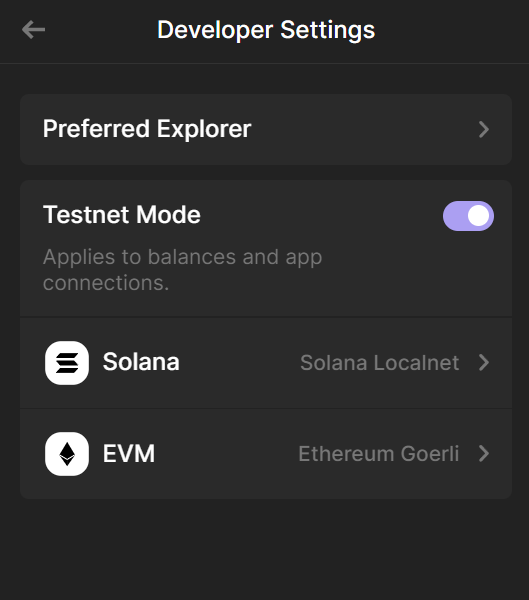
   
3. Start validator:

```bash
solana-test-validator --bpf-program <PROGRAM_ID> ./tic_tac_toe.so --reset
```

4. Get public key:
   
5. Airdrop
6. Navigate to app
7. Connect wallet
   
8. Create second wallet:


9. Rename wallets to Player 1 and Player 2


10. Airdrop to player 2

11. Connect player 2 to app


12. Approve transaction


🎆

Once you are done, enter `done` in the terminal.

### --tests--

You should enter `done` in the terminal

```js
const lastCommand = await __helpers.getLastCommand();
assert.include(lastCommand, 'done');
```

## --fcc-end--
