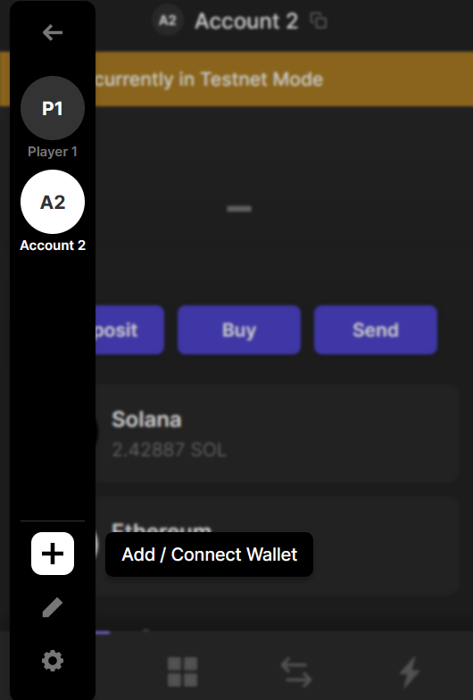
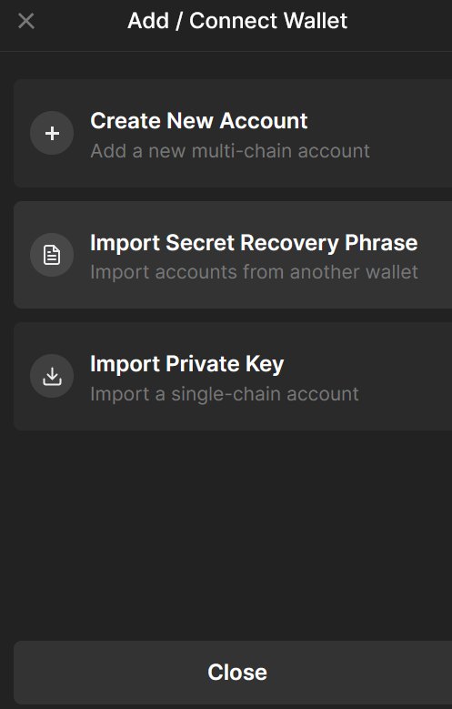

# Solana - Learn How to Deploy to Devnet

## 1

### --description--

You have been started with the same programa and app as the previous project. This time, you will deploy it to the public Devnet!

First, start by ensuring it still works locally:

1. Install all dependencies
2. Build the program
3. Start a local Solana cluster
   3.1 Deploy the program to the local cluster
4. Start the client server
5. Test the program

### --tests--

You should run `yarn` in the `learn-how-to-deploy-to-devnet/todo/` directory to install all dependencies.

```js
const { access, constants } = await import('fs/promises');
await access(join(project.dashedName, 'todo/node_modules'), constants.F_OK);
```

You should run `anchor build` in the `learn-how-to-deploy-to-devnet/todo/` directory to build the program.

```js
const { access, constants } = await import('fs/promises');
await access(join(project.dashedName, 'todo/target'), constants.F_OK);
```

You should have a local cluster running at `http://localhost:8899`.

```js
const command = `curl http://localhost:8899 -X POST -H "Content-Type: application/json" -d '{"jsonrpc":"2.0","id":1, "method":"getHealth"}'`;
const { stdout, stderr } = await __helpers.getCommandOutput(command);
try {
  const jsonOut = JSON.parse(stdout);
  assert.deepInclude(jsonOut, { result: 'ok' });
} catch (e) {
  assert.fail(e, 'Try running `solana-test-validator` in a separate terminal');
}
```

You should deploy the program to the local cluster.

```js
const { stdout: keys } = await __helpers.getCommandOutput(
  'anchor keys list',
  `${project.dashedName}/todo`
);
const expectedProgramId = keys.match(/[^\s]{44}/)?.[0];
const command = `curl http://127.0.0.1:8899 -X POST -H "Content-Type: application/json" -d '
  {
    "jsonrpc": "2.0",
    "id": 1,
    "method": "getAccountInfo",
    "params": [
      "${expectedProgramId}", {
        "encoding": "base64",
        "dataSlice": {
          "length": 0,
          "offset": 0
        }
      }
    ]
}'`;
const { stdout, stderr } = await __helpers.getCommandOutput(command);

try {
  const jsonOut = JSON.parse(stdout);
  assert.equal(jsonOut.result?.value?.executable, true);
} catch (e) {
  assert.fail(
    e,
    `Try running \`solana-test-validator --bpf-program ${expectedProgramId} ./target/deploy/todo.so --reset\``
  );
}
```

You should run `yarn dev` in the `learn-how-to-deploy-to-devnet/todo/app/` directory to start the client server.

```js
const response = await fetch('http://localhost:5173');
assert.equal(response.status, 200, 'The server should be running.');
```

You should perform some transactions using the client app.

```js
const { Connection, PublicKey } = await import('@solana/web3.js');
const connection = new Connection('http://127.0.0.1:8899', 'confirmed');

const { stdout: keys } = await __helpers.getCommandOutput(
  'anchor keys list',
  `${project.dashedName}/todo`
);
const expectedProgramId = keys.match(/[^\s]{44}/)?.[0];
const pubkey = new PublicKey(expectedProgramId);
const transactions = await connection.getConfirmedSignaturesForAddress2(pubkey);
assert.isAtLeast(
  transactions,
  2,
  'Try using the client interface and your wallet to make a few transactions'
);
```

## 2

### --description--

It is often good practice to _vet_ a public program befor using it. In the best case scenario, you can vet the source code yourself to ensure it is safe.

With programs deployed as bytecode, it is difficult to determine what the program does. Anchor provides a tool to help you verify a program matches the source code:

```bash
anchor verify <PROGRAM_ID>
```

Provided you have the supposed source code for a program, you can run that command in the program directory to verify it is the source code for the public program id.

Verify the program you deployed to the local cluster matches its source code.

### --tests--

You should run `anchor verify <PROGRAM_ID>` in the `learn-how-to-deploy-to-devnet/todo/programs/todo` directory to verify the program.

```js
const lastCommand = await __helpers.getLastCommand();
const { stdout: keys } = await __helpers.getCommandOutput(
  'anchor keys list',
  `${project.dashedName}/todo`
);
const expectedProgramId = keys.match(/[^\s]{44}/)?.[0];
assert.include(lastCommand, `anchor verify "${expectedProgramId}"`);
```

## 3

### --description--

In order to work with the public Devnet, you will need to create a wallet. Instead of creating a wallet directly in Phantom, create a wallet using the Solana CLI. However, in order for this wallet to be compatible with Phantom, you will need to create the wallet using the `--derivation-path` flag.

A derivation path is a way to create a wallet that is compatible with other wallets. Phantom uses the derivation path `m/44'/501'/0'/0'` to create wallets.

Save this wallet to `learn-how-to-deploy-to-devnet/todo/wallet.json`.

### --tests--

You should run `solana-keygen new --outfile wallet.json --derivation-path` in the `learn-how-to-deploy-to-devnet/todo/` directory to create a wallet.

```js
const { access, constants } = await import('fs/promises');
await access(join(project.dashedName, 'todo/wallet.json'), constants.F_OK);
```

## 4

### --description--

Now, to work on the Devnet, change your Solana config to use the Devnet URL.

### --tests--

You should run `solana config set --url devnet`.

```js
const lastCommand = await __helpers.getLastCommand();
assert.include(lastCommand, 'solana config set --url devnet');
```

## 5

### --description--

In order to deploy to Devnet, you will need to have enough SOL to pay for the transaction fees.

As Devnet is considered a testing network, you can get SOL by requesting an airdrop to your public key.

Airdrop 2 SOL to your public key.

### --tests--

You should run `solana airdrop 2 --keypair wallet.json` in the `learn-how-to-deploy-to-devnet/todo/` directory to airdrop 2 SOL to your public key.

```js
const { stdout } = await __helpers.getCommandOutput(
  `solana balance ${project.dashedName}/todo/wallet.json`
);
const balance = stdout.trim()?.match(/\d+/)?.[0];
assert.isAtLeast(
  parseInt(balance),
  2,
  'Try running `solana airdrop 2 --keypair wallet.json` within `todo/`'
);
```

## 6

### --description--

Now that you have a wallet with SOL, you can deploy the program to Devnet.

First, adjust the `Anchor.toml` file so the `provider.cluster` points to Devnet.

### --tests--

You should have `cluster = "devnet"` in the `learn-how-to-deploy-to-devnet/todo/Anchor.toml` file.

```js
const codeString = await __helpers.readFile(
  join(project.dashedName, 'todo/Anchor.toml')
);
assert.match(codeString, /cluster\s*=\s*"devnet"/);
```

## 7

### --description--

Adjust the wallet path in the `Anchor.toml` file to point to the wallet you created.

### --tests--

You should have `wallet = "./wallet.json"` in the `learn-how-to-deploy-to-devnet/todo/Anchor.toml` file.

```js
const codeString = await __helpers.readFile(
  join(project.dashedName, 'todo/Anchor.toml')
);
assert.match(codeString, /wallet\s*=\s*"\.\/wallet\.json"/);
```

## 8

### --description--

Add a `[programs.devnet]` section to the `Anchor.toml` file, and add a `todo` key with the value of the program id you will deploy to.

### --tests--

You should have a `[programs.devnet]` section in the `learn-how-to-deploy-to-devnet/todo/Anchor.toml` file.

```js
const codeString = await __helpers.readFile(
  join(project.dashedName, 'todo/Anchor.toml')
);
assert.match(codeString, /\[programs\.devnet\]/);
```

You should have a `todo = "<PROGRAM_ID>"` key in the `[programs.devnet]` section.

```js
const codeString = await __helpers.readFile(
  join(project.dashedName, 'todo/Anchor.toml')
);
const { stdout: keys } = await __helpers.getCommandOutput(
  'anchor keys list',
  `${project.dashedName}/todo`
);
const expectedProgramId = keys.match(/[^\s]{44}/)?.[0];
const actualProgramId = codeString.match(
  /\[programs\.devnet\]\s*todo\s*=\s*"([^"]{44})"/
)?.[1];
assert.equal(expectedProgramId, actualProgramId);
```

## 9

### --description--

Use the Anchor CLI to deploy the program to Devnet. _This should fail_.

### --tests--

You should run `anchor deploy` in the `learn-how-to-deploy-to-devnet/todo/` directory and see an error.

```js
// TODO
const terminalOut = await __helpers.getTerminalOutput();
assert.include(terminalOut, 'insufficient funds for fee');
```

## 10

### --description--

You do not have enough funds to pay for the program deployment transactions. You will need to airdrop more SOL to your wallet.

Airdrop 2 SOL to your `wallet.json` account. _This should fail_.

### --tests--

You should run `solana airdrop 2 --keypair wallet.json` in `learn-how-to-deploy-to-devnet/todo/`.

```js
// TODO
const terminalOut = await __helpers.getTerminalOutput();
assert.include(terminalOut, '');
```

## 11

### --description--

You have been rate limited by the Solana Devnet. You can wait a few minutes before airdropping again, or:

```bash
# Create a temporary wallet
todo/ $ solana-keygen new --outfile temp.json --derivation-path
# Airdrop 2 SOL to the temporary wallet
todo/ $ solana airdrop 2 --keypair temp.json
# Set the Solana CLI to use the temporary wallet
todo/ $ solana config set --keypair temp.json
# Transfer 1.95 SOL from the temporary wallet to your wallet
todo/ $ solana transfer 1.95 wallet.json
```

### --tests--

Your `wallet.json` account should have `3.95` SOL.

```js
const { stdout } = await __helpers.getCommandOutput(
  `solana balance ${project.dashedName}/todo/wallet.json`
);
const balance = stdout.trim()?.match(/\d+/)?.[0];
assert.isAtLeast(parseInt(balance), 3.95);
```

## 12

### --description--

Deploy the program to Devnet.

_This usually takes a few minutes to complete._

### --tests--

You should run `anchor deploy` in the `learn-how-to-deploy-to-devnet/todo/` directory.

```js
// TODO
const terminalOut = await __helpers.getTerminalOutput();
assert.include(terminalOut, 'Deploying program to chain');
```

## 13

### --description--

Verify the program matches the source code.

### --tests--

You should run `anchor verify "<PROGRAM_ID>"` in the `learn-how-to-deploy-to-devnet/todo/programs/todo` directory to verify the program.

```js
const lastCommand = await __helpers.getLastCommand();
const { stdout: keys } = await __helpers.getCommandOutput(
  'anchor keys list',
  `${project.dashedName}/todo`
);
const expectedProgramId = keys.match(/[^\s]{44}/)?.[0];
assert.include(lastCommand, `anchor verify "${expectedProgramId}"`);
```

## 14

### --description--

With your program deployed, ensure your `.env` file has the correct program id and cluster endpoint.

Then start the app client server.

### --tests--

You should run `yarn dev` in the `learn-how-to-deploy-to-devnet/todo/app/` directory.

```js
const response = await fetch('http://localhost:5173');
assert.equal(response.status, 200, 'The client server should be running.');
```

## 15

### --description--

In your browser, import your wallet into Phantom:





After inputting your secret recovery phrase, you should see your wallet in Phantom.

### --tests--

You should type `done` in the terminal.

```js
const lastCommand = await __helpers.getLastCommand();
assert.include(lastCommand, 'done');
```

## 16

### --description--

Open the app in your browser, and perform some transactions.

### --tests--

You should type `done` in the terminal.

```js
const lastCommand = await __helpers.getLastCommand();
assert.include(lastCommand, 'done');
```

## 17

### --description--

Congratulations! You have deployed your program to Devnet!

**Summary**

1. Adjust all config files to use Devnet
2. Create a wallet using the Solana CLI
3. Airdrop SOL to your wallet
4. Use `anchor verify` to verify any programs you use match their source code
5. Deploy the program to Devnet
6. Share your app with others

🎆

Once you are done, enter `done` in the terminal.

### --tests--

You should enter `done` in the terminal

```js
const lastCommand = await __helpers.getLastCommand();
assert.include(lastCommand, 'done');
```

## --fcc-end--
